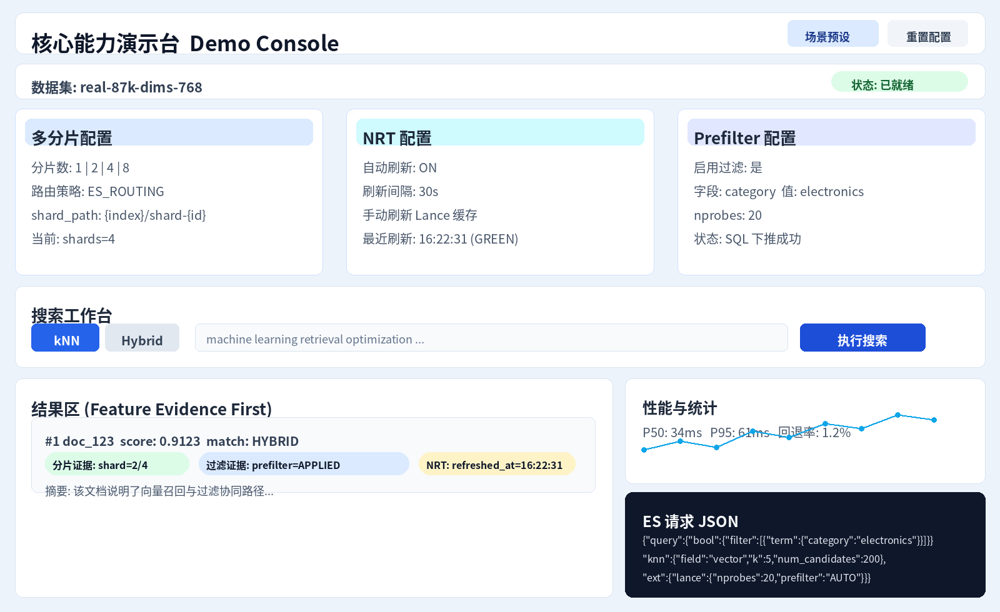
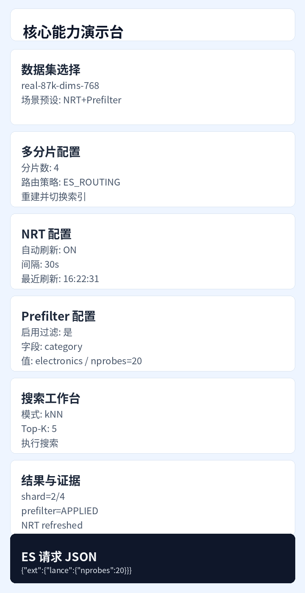
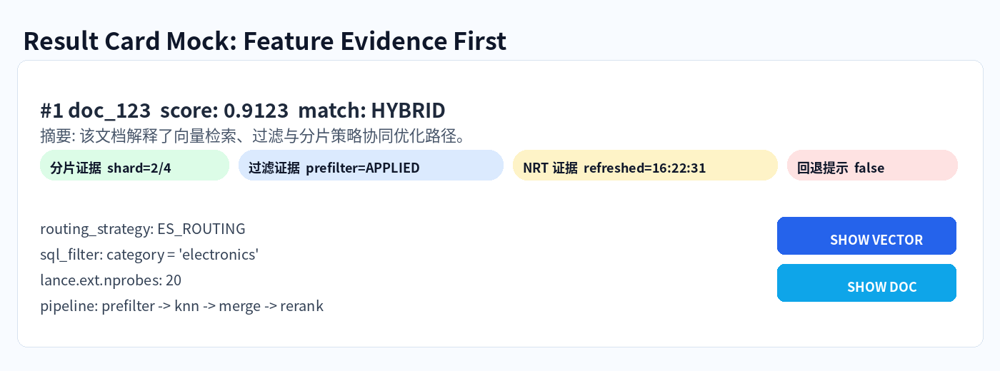

# PRD: Demo UI Upgrade for Multi-Sharding, NRT, and Prefiltering

## 1. Document Info
- Product: `es-lance-demo` Live Demo
- Version: `v1.0`
- Date: `2026-02-10`
- Owner: Demo Experience / Search Platform
- Related plan: `docs/demo_ui_server_nt_scale_plan.md`

## 2. Background
Current demo UI can run kNN/hybrid queries, show timing, and inspect ES request JSON. It is strong for baseline search demos, but not yet structured to clearly demonstrate the three new core features:

1. Multi-sharding behavior
2. Near-real-time refresh (NRT)
3. Prefiltering strategy and fallback path

The goal of this PRD is to define an explicit UI redesign and supporting API updates so the demo can be used in technical presentations and validation sessions with a clear narrative in Chinese.

## 3. Product Goal
Build a **Capability Demo Console** in the existing Live Demo area so a presenter can:

1. Configure core plugin behaviors from UI
2. Run controlled experiments (before/after)
3. Observe outcome and timing in one screen
4. Explain the path in Chinese without code switching to terminal

## 4. Success Criteria
- Presenter can finish a full 3-feature demo in <= 8 minutes.
- Each feature has dedicated controls + status + result evidence in UI.
- UI can show not only “query succeeded” but “which strategy was used”.
- Chinese labels are complete for all new controls and status messages.
- No regression in existing search flow (`kNN`, `Hybrid`, `Show ES Request`, result expansion).
- Dataset creation/upload supports explicit `shard_count` and `sharding_strategy`.
- After dataset selection, shard config is auto-detected and reused by mapping + kNN + hybrid.
- Implementation keeps existing server visual style (no style redesign mixed into this change).

## 5. Users & Main Scenario
### Primary user
- Internal engineer / solutions architect doing live demos.

### Core scenario
1. Open Live Demo.
2. Select dataset and scenario preset.
3. Configure sharding / refresh / prefilter knobs.
4. Execute search.
5. Show timeline + query + feature-specific evidence.
6. Switch scenario and repeat.

## 6. Scope
### In scope
- New UI sections and Chinese UX copy
- New frontend states and feature controls
- New server proxy APIs for Lance stats/refresh/config
- Search API extension for filter / nprobes
- Backfill/index creation extension for shard-aware mapping options
- Dataset profile contract (`dataset.meta.json`) for shard configuration persistence
- Chinese font readability fix (font fallback only, no theme/layout change)

### Out of scope
- New plugin algorithm development in ES codebase
- Cross-cluster demo orchestration
- Full observability dashboard in Kibana (only linked/optional)

## 7. UX Principles
1. **One screen demo**: avoid context switching to CLI.
2. **Explain by evidence**: each feature must have visible proof.
3. **Safe defaults**: controls default to known-good settings.
4. **Progressive disclosure**: advanced knobs collapsed by default.
5. **Chinese-first copy** with technical keywords preserved (NRT, Prefilter, ES_ROUTING).
6. **Style freeze**: reuse current UI style tokens/components; no visual language refactor.

## 8. Information Architecture (Live Demo section)
New layout inside current `LiveDemo`:

1. Capability Header (new)
2. Dataset Selector (existing, upgraded copy)
3. Feature Control Panels (new):
   - Multi-Sharding
   - NRT Refresh
   - Prefiltering
4. Search Workbench (existing controls, expanded)
5. Result Explorer (existing results, upgraded annotations)
6. Observability Area:
   - Performance Profiling (existing)
   - Performance Timeline (existing hybrid)
   - Lance Stats Snapshot (new)
   - ES Request Viewer (existing)

## 9. UI Mockups & Wireframes (Focus on UI Changes)

## 9.1 High-fidelity mock (desktop)

<figure>
  <object data="assets/mock-ui-desktop.svg" type="image/svg+xml" class="mock-svg">
    
  </object>
  <figcaption>Demo Console Desktop Mock (SVG primary, PNG fallback)</figcaption>
</figure>

`SVG backup:` [assets/mock-ui-desktop.svg](assets/mock-ui-desktop.svg)

Design intent:
- Keep the full demo path in one screen: configure -> run -> explain evidence.
- Put three capability cards at the top fold: Multi-sharding, NRT, Prefilter.
- Reserve right-bottom for ES request JSON so presenters can prove backend request shape.
- Keep evidence chips in result cards and place them above summary text.
- Match existing server style (`glass-card`, current dark palette, existing spacing/button language).

## 9.2 High-fidelity mock (mobile)

<figure>
  <object data="assets/mock-ui-mobile.svg" type="image/svg+xml" class="mock-svg">
    
  </object>
  <figcaption>Demo Console Mobile Mock (SVG primary, PNG fallback)</figcaption>
</figure>

`SVG backup:` [assets/mock-ui-mobile.svg](assets/mock-ui-mobile.svg)

Design intent:
- Force stacked cards on mobile to avoid horizontal clipping for Chinese labels.
- Keep capability controls as first-class cards, not hidden in advanced drawers.
- Maintain result evidence chips even on small screens.
- Preserve existing mobile visual style from current server instead of introducing new theme.

## 9.3 Result card evidence mock

<figure>
  <object data="assets/mock-ui-result-evidence.svg" type="image/svg+xml" class="mock-svg">
    
  </object>
  <figcaption>Result Card Evidence Mock (SVG primary, PNG fallback)</figcaption>
</figure>

`SVG backup:` [assets/mock-ui-result-evidence.svg](assets/mock-ui-result-evidence.svg)

Design intent:
- Promote evidence first, content second.
- Freeze three evidence dimensions in top region: shard, prefilter, NRT.
- Show fallback state as explicit pill to avoid ambiguity during demos.

## 9.4 Interaction states for demo script

| State | UI signal | Presenter message (Chinese) |
|---|---|---|
| Idle | All cards editable, `执行搜索` enabled | 当前配置已就绪，准备开始实验 |
| Rebuilding index | Multi-sharding card shows progress + disabled search | 正在重建分片索引，请稍候 |
| Refreshing NRT | NRT card shows spinner + last refresh pending | 正在刷新近实时缓存 |
| Query running | Search button loading, result area skeleton | 正在执行查询并收集证据 |
| Query success | Evidence chips + timeline rendered | 查询完成，下面看路径证据 |
| Prefilter fallback | Warning pill in result + detail in JSON | 命中过滤回退路径，已标注原因 |

## 9.5 Low-fidelity wireframe (reference)

```text
[核心能力演示台]
  ├─ [多分片配置]
  ├─ [NRT 配置]
  ├─ [Prefilter 配置]
  ├─ [搜索工作台]
  ├─ [结果区 + 证据标签]
  ├─ [性能时间线]
  └─ [ES 请求 JSON]
```

## 10. UI Changes by Existing Files

## 10.1 `features/live-demo/ui/live-demo.tsx`
### Add
- New state groups:
  - `shardingConfig`
  - `nrtConfig`
  - `prefilterConfig`
  - `featureStatus`
  - `demoPreset`
- New API calls:
  - `/api/lance/stats`
  - `/api/lance/refresh`
  - `/api/lance/refresh-config`
- New “Capability Header” and three control cards.
- New metadata line for feature evidence after each search.
- Dataset profile-driven config state:
  - `shardCount`
  - `shardingStrategy`
  - `shardPath` / `datasetName` (optional)

### Change
- Existing dataset switch flow: keep alias-based fast switch, but auto-load profile and pass to backfill.
- Existing search request body: include `filter`, optional `nprobes`, and resolved dataset context.

## 10.2 `features/live-demo/ui/search-controls.tsx`
### Add
- Filter enable toggle
- Field selector (`category`, `topic`, `dataset`)
- Term value input
- nprobes input (advanced)

### Change
- Top-K input logic should preserve explicit 0/invalid handling using nullish-safe parsing (avoid `||` traps).
- Any Chinese labels in controls should use readable CJK-capable font stack (avoid unreadable mono-only rendering).

## 10.3 `features/live-demo/ui/results-display.tsx`
### Add
- “Feature Evidence” block:
  - shard mode
  - refresh status timestamp
  - prefilter decision
- Dedicated warning pill when fallback path used.

### Change
- Keep existing timeline and profiling, but prepend Chinese labels.
- Keep existing styling classes; do not introduce unrelated color/layout redesign.

## 10.4 `features/vector-mgmt/ui/vector-management.tsx`
### Add
- Dataset generation modal fields:
  - `分片数 (shard_count)`
  - `分片算法 (sharding_strategy: NONE | ES_ROUTING)`
- Dataset list shows recognized shard profile summary.

### Change
- Reuse current modal/card/button style; only add functional controls.

## 11. API & Contract Changes

## 11.0 Dataset profile contract (new)
Object location recommendation:
- `datasets/{dataset}/dataset.meta.json`

Example:
```json
{
  "version": 1,
  "dataset": "vectors-100-dims-768",
  "dims": 768,
  "vectors": 100,
  "shard_count": 4,
  "sharding_strategy": "ES_ROUTING",
  "shard_path": "{index}/shard-{shard_id}",
  "dataset_name": "data.lance"
}
```

Used by:
- `/api/vectors/list` (return profile fields)
- `/api/vectors/backfill` (mapping/index creation)
- Live Demo dataset switch and search requests

## 11.1 Search API
### `POST /api/search`
New request fields:
- `filter?: object | object[]`
- `nprobes?: number`

Example:
```json
{
  "dataset": "real-87k-dims-768",
  "k": 5,
  "numCandidates": 10,
  "profile": true,
  "queryVector": [0.1, 0.2],
  "filter": { "term": { "category": "electronics" } },
  "nprobes": 20
}
```

## 11.2 Hybrid API
### `POST /api/search/hybrid`
Vector branch supports same filter/nprobes pass-through for Lance query.
Hybrid must resolve target index by selected dataset profile (same as kNN path), not by stale global assumption.

## 11.3 New Lance proxy APIs
1. `GET /api/lance/stats`
   - proxy to `GET /_lance/stats`
2. `POST /api/lance/refresh`
   - proxy to `POST /_lance/refresh`
3. `GET /api/lance/refresh-config`
   - return `lance.refresh.enabled`, `lance.refresh.interval`
4. `PUT /api/lance/refresh-config`
   - update cluster settings (with permission-safe error handling)

## 11.4 Backfill extension
### `POST /api/vectors/backfill`
New request fields:
- `numberOfShards`
- `shardAware`
- `uriPrefix`
- `shardPath`
- `datasetName`
- `shardingStrategy`
- `fieldMapping`
- `profile` (optional object from dataset meta; server-side validation still required)

If `shardAware=true`, mapping for `embedding.storage` uses shard-aware fields.

Index switch strategy:
- Keep per-dataset indices and alias-based fast switching.
- Do not delete existing ES indices or Lance datasets during normal dataset switch.
- Recreate target dataset index only if profile mismatch is detected.

## 11.5 Dataset generation/upload extension
### `POST /api/vectors/generate` and/or Python backend generate endpoint
New request fields:
- `shard_count`
- `sharding_strategy`

Generation/upload flow must persist these fields into dataset profile metadata.

## 12. UX States (New)

## 12.1 Multi-sharding
- Idle: shows current index + strategy.
- Switching: spinner + “正在重建分片索引…”.
- Success: green badge with shard summary.
- Failure: red alert with returned error and recovery hint.

## 12.2 NRT
- Auto refresh enabled/disabled badge.
- Manual refresh in progress state.
- Stats stale indicator if last poll > 60s.

## 12.3 Prefilter
- Applied: green “已下推到 Lance SQL”.
- Fallback: amber “下推失败，已回退 ES 后过滤”.
- No filter: neutral “未启用过滤条件”.

## 13. Chinese Copy (Key Labels)
- 核心能力演示台
- 多分片配置
- 近实时刷新（NRT）
- 预过滤（Prefilter）
- 手动刷新 Lance 缓存
- 重建并切换索引
- 预过滤状态
- 已回退到 ES 后过滤
- 分片数
- 分片算法

Chinese font requirement:
- Use CJK-capable fallback stack (e.g., `Noto Sans SC`, `PingFang SC`, `Microsoft YaHei`).
- Do not rely on mono-only font classes for Chinese labels.

## 14. Non-Functional Requirements
- New controls should not add > 100ms UI-side overhead per interaction.
- Polling for stats default 10s, pause while tab not focused.
- All new components must follow existing visual language (`glass-card`, gradient buttons).
- Mobile support: no horizontal overflow at 375px width.
- Visual change budget: only functional additions; no unrelated style/theme refactor in this milestone.

## 15. Instrumentation
Add frontend-level event hooks (console/logger acceptable for demo phase):
- `demo.sharding.apply`
- `demo.nrt.refresh.manual`
- `demo.prefilter.toggle`
- `demo.search.execute`

Add response metadata fields in API result where possible:
- `featureEvidence.sharding`
- `featureEvidence.prefilter`
- `featureEvidence.refresh`

## 16. Acceptance Criteria

## 16.1 UX Acceptance
- Presenter can complete 3 feature demos in one page without terminal.
- All new controls and status text are Chinese.
- ES Request panel reflects active filter/sharding related query changes.
- Chinese labels are readable in target browsers (no garbled/fallback-missing glyphs).
- New controls visually match current server style.

## 16.2 Functional Acceptance
- Shard-aware mapping created successfully when selected.
- Manual refresh API is callable and status visible.
- Filtered query executes with either pushdown or fallback, and UI indicates which.
- Dataset creation/upload can set `shard_count` + `sharding_strategy`.
- Dataset selection auto-recognizes shard config and drives both kNN and Hybrid index resolution.
- Dataset switching does not require deleting ES indices or Lance datasets.

## 16.3 Regression Acceptance
- Existing `kNN` and `Hybrid` flows still work.
- Existing result expand/collapse and ES request viewer still work.

## 17. QA Checklist
1. No dataset: warning shown, controls disabled correctly.
2. Invalid refresh interval: validation message shown.
3. Invalid filter JSON/input: request blocked client-side.
4. ES unavailable: API failure surfaced with actionable hint.
5. Strategy switch from `ES_ROUTING` to `NONE` updates evidence line.

## 18. Rollout Plan

### Phase 1
- API proxy + data contracts + backfill extension.

### Phase 2
- UI cards + state wiring + Chinese copy.

### Phase 3
- Evidence rendering + test script + demo rehearsal.

## 19. Demo Script (Chinese)
1. 先运行基线：`1 shard + NONE + 无过滤`。
2. 切到 `4 shards + ES_ROUTING`，重建后同查询对比。
3. 开启过滤：`category=electronics`，展示下推/回退状态。
4. 手动触发 NRT 刷新，再次查询，展示刷新后状态与统计。
5. 打开 ES 请求 JSON，解释 DSL 与配置对应关系。

## 20. Open Questions
1. Cluster settings 写权限是否在所有 demo 环境可用？
2. Prefilter evidence 口径是否以后端明确字段返回为准（建议是）？
3. 是否需要在 UI 中增加“示例过滤模板”以减少演示输入时间？
4. 对于 `ES_ROUTING`，是否要求数据生成阶段提供真实 shard-aware Lance 布局（推荐）？
